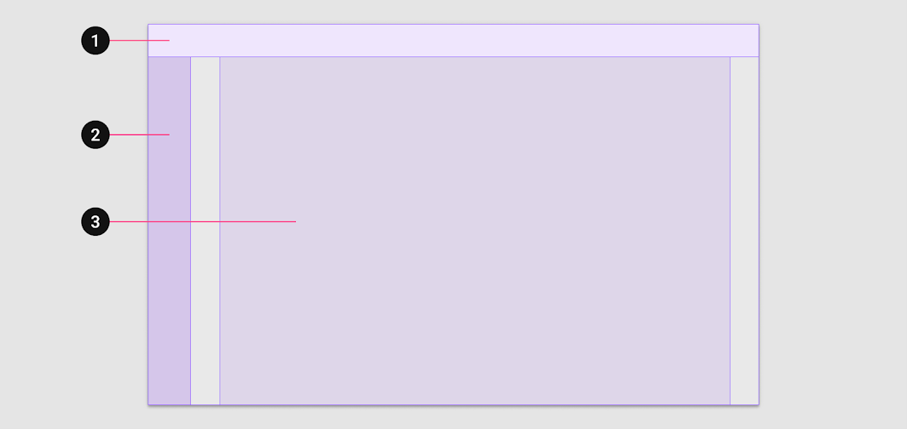
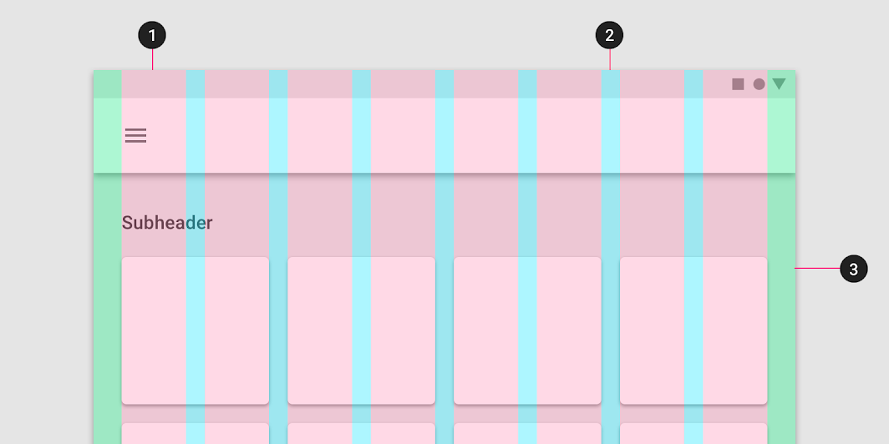

# fl_responsive_guide

<p align="center">

  <a href="https://pub.dartlang.org/packages/fl_responsive_guide">
    
  </a>
  <br/>
  <a href="https://github.com/dangngocduc/flutter_responsive">
    
  </a>
  <a href="https://github.com/tenhobi/effective_dart">
    
  </a>
  <a href="https://opensource.org/licenses/MIT">
    
  </a>
</p>


## Basic

Để hiểu được về việc build reponsive chúng ta cần nhìn lại 1 số khái niệm mà Material Design đề cập đến như:
Layout anatomy : <https://material.io/design/layout/understanding-layout.html#layout-anatomy>
Trong phần này chúng ta sẽ tìm hiểu được các định nghĩa của:

AppBar: <https://material.io/design/layout/understanding-layout.html#layout-anatomy>

Device breakpoints: <https://material.io/design/layout/responsive-layout-grid.html#breakpoints>

Navigation region:  <https://material.io/design/layout/understanding-layout.html#layout-anatomy>

Columns, Gutters, Margin: <https://material.io/design/layout/responsive-layout-grid.html#columns-gutters-and-margins>

Sau khi tìm hiểu các thông tin trên ta sẽ thấy việc build 1 giao diện responsive sẽ cần dựa trên các thông số trên để làm việc. ở đây chúng ta
sẽ có 1 class là _ResponsiveGuide_
_ResponsiveGuide_ là 1 _InheritedWidget_ cho phép các widget bên dưới của nó có thể nhận đc thông tin thay đổi về config build _FlDesignConfig_

Mỗi 1 breakpoint sẽ có 1 config riêng để xác định loại render khi cần. Các thông số render UI như bên dưới.

```Dart
  final FlSize margin; -> Dùng xác định cho margin của Body
  final FlSize body; -> Dùng xác định width của body
  final int layoutColumns; -> config cho số column trong body
  final double gutters; -> 
  final DeviceTarget deviceTarget; -> config xem giao diện của breakpoint này sẽ render cho device nào.
  final double? navigationRailWidth;
  final double appbarHeight;
  final double drawerWidth;
  final double tabBarHeight;
```

Trong đó chúng ta cần chú ý đến _FlSize_. Class này sẽ cho phéo chúng ta xác định khi nào cần khai báo size cụ thể, khi nào cần để nó auto scale theo màn hình.

```Dart
abstract class FlSize {
  FlSize();

  factory FlSize.size(double size) {
    return FlSizeNumber(size);
  }

  factory FlSize.scale() {
    return FlSizeScale();
  }
}

class FlSizeNumber extends FlSize {
  final double number;

  FlSizeNumber(this.number);
}

class FlSizeScale extends FlSize {}
```

## Implement

### Breakpoints System of your application


1: _App bars_
2: _Navigation/Drawer_
3: _Body_


1: _Columns_
2: _Gutters_
3: _Margins_

Về cơ bản thì việc build 1 ứng dụng responsive sẽ là việc xác định các dạng màn hình (xác định bởi breakpoint). Dựa trên breakpoint đang có để quyết định giao diện sẽ build. Do đó ta cần xác định Breakpoint cho ứng dụng của mình.

Dưới đây là 1 hướng dẫn chia breakpoint của Material Design:
|Screen size|Margin|Body|Layout columns|
|---|---|---|---|
|0-599dp|16dp|Scaling|4|
|600-904|32dp|Scaling|8|
|905-1239|Scaling|840dp|12|
|1240-1439|200dp|Scaling|12|
|1440+|Scaling|1040|12|

Ví dụ khi áp dụng:

```Dart
      breakpointSystems: {
        600: FlDesignConfig(
            body: FlSize.scale(),
            margin: FlSize.size(0),
            appbarHeight: 56,
            deviceTarget: DeviceTarget.mobile),
        900: FlDesignConfig(
            body: FlSize.scale(),
            margin: FlSize.size(0),
            gutters: 12,
            appbarHeight: 56,
            deviceTarget: DeviceTarget.tablet),
        double.maxFinite: FlDesignConfig(
            body: FlSize.size(621),
            margin: FlSize.scale(),
            gutters: 24,
            appbarHeight: 80,
            deviceTarget: DeviceTarget.desktop)
      }
```

Với _breakpointSystems_ này ta có thể thấy được, ứng dụng được chia làm 3 loại màn hình:

1: 0 < width < 600 => loại này đc xác định device là _mobile_, _appbarHeight_ có chiều cao 56dp

2: 600 =< width < 900 => loại này đc xác định device là _tablet_, _appbarHeight_ có chiều cao 56dp, gutter là 12dp

3: width >= 900  => loại này đc xác định device là _desktop_, _appbarHeight_ có chiều cao 80dp, gutters là 24dp

### Create wrapper widget which support build responsive

Sau khi xác định được breakpoints cho ứng dụng, các widget khi render sẽ xác định UI mình cần render dựa trên breakpoint nào.

Để thực hiện được việc này ta sẽ cần 2 class:

1. _ResponsiveGuideWrapper_ nó giống như 1 Provider của responsive layout. Cho phép các widget con của nó có thể xác định đc breakpoint hiện tại đang sử dụng để render là gì.

2. _ResponsiveGuideConsumerWidget_ 1 Widget consumer cho phép widget child biết thông số hiện tại khi render là gì.

Ví dụ:

```Dart
  Widget build(BuildContext context) {
    return ResponsiveGuideWrapper(
      breakpointSystems: {
        600: FlDesignConfig(
            body: FlSize.scale(),
            margin: FlSize.size(0),
            appbarHeight: 56,
            deviceTarget: DeviceTarget.mobile),
        900: FlDesignConfig(
            body: FlSize.scale(),
            margin: FlSize.size(0),
            gutters: 12,
            appbarHeight: 56,
            deviceTarget: DeviceTarget.tablet),
        double.maxFinite: FlDesignConfig(
            body: FlSize.size(621),
            margin: FlSize.scale(),
            gutters: 12,
            appbarHeight: 56,
            deviceTarget: DeviceTarget.desktop)
      },
      child: Application(),
    );
  }
}
```

Sử dụng:

```Dart
      body: ResponsiveGuideConsumerWidget(
        builder: (context, designInfo) {
          switch (designInfo.deviceTarget) {
            case DeviceTarget.mobile:
              return Center(
                child: Text('Mobile App'),
              );
            case DeviceTarget.tablet:
              return Center(
                child: Text('Tablet App'),
              );
            case DeviceTarget.desktop:
              return Center(
                child: Text('Desktop App'),
              );
          }
        },
      )
```
